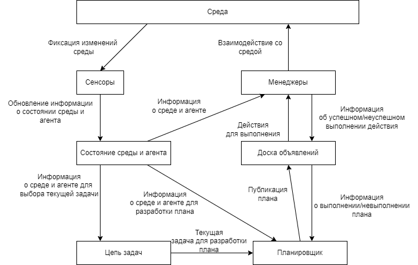

# Архитектура программы планирования действий в стратегической игре

Ключевые слова: планирование, игровой искусственный интеллект, стратегии в реальном времени, StarCraft.

## Аннотация

В данной статье были рассмотрены существующие решения в области планирования действий искусственным интеллектом в стратегических играх в реальном времени, описаны их главные достоинства и недостатки. Такие недостатки рассмотренных аналогов, как зависимость от экспертных знаний у обучаемых моделей и отсутствие поддержки принятия решений на стратегическом уровне, были учтены в разработанных математической модели и архитектуре, описание которых приведено в статье. Данная архитектура позволяет разработать полноценную реализацию искусственного интеллекта, решающего задачу планирования действий с учётом текущей ситуации в игре. 

## Введение

Игры RTS (стратегии в реальном времени) популярны среди игроков по всему миру. Игра StarCraft[1] является соревновательной общемировой RTS-игрой, считается  сбалансированной и недавно стала испытательным полигоном для методов искусственного интеллекта. Соревновательные матчи по StarCraft проводятся не только между игроками, но и между разными реализациями внутриигрового искусственного интеллекта.

Искусственный интеллект в играх жанра RTS в настоящее время очень предсказуем, и игроки находят разные способы обыгрывать даже лучших ботов. Большинство алгоритмов, которые работают в традиционных играх, не могут быть применены к играм RTS или просто неэффективны в вычислительном отношении. Данная область исследований интересна и с практической точки зрения, потому что в ней существуют подзадачи, которые связаны с задачами в реальной жизни. Управление производством в играх RTS напоминает проблемы промышленного производства в реальном мире. Алгоритмы, изобретенные для управления движением юнитов в играх RTS, позже могут быть распространены на управление дорожным движением в реальных городах. Гораздо проще решить эти проблемы и оценивать результаты в контролируемой среде, а не в реальной жизни.

Использование системы планирования действий с учётом текущей ситуации в игре позволит искусственному интеллекту просматривать разные последовательности действий, оценивать их эффективность и адаптировать их, что сделает его поведение менее предсказуемым.

Целью работы является разработка архитектуры искусственного интеллекта, решающего задачу пла­нирования действий в стратегической игре с учётом текущей ситуации в игре.

Для достижения цели были поставлены следующие задачи:
1. Поиск и сравнение аналогов реализаций искусственного интеллекта в стратегических играх жанра RTS;
2. Формулирование требований к разрабатываемому искусственному интеллекту;
3. Описание математической модели решения;
4. Описание архите­ктуры решения.

Объектом исследования стал искусственный интеллект в компьютерных играх жанра RTS, предметом - задача планирования действий в RTS-играх.

## Обзор предметной области

### Принцип отбора аналогов

Для определения критериев, которым должна соответствовать разрабатываемая архитектура, было изучено несколько аналогов. В отбираемые аналоги вошли существующие реализации искусственного интеллекта для игр жанра RTS (стратегий реального времени), преимущественно для StarCraft, на основе методов, использующих систему планирования действий. Аналоги были взяты из статьи 2014 года "A review of real-time strategy game AI"[2].

#### Darmok

Darmok[3] использует метод Case-Based Planning (CBP, планирование на основе конкретных случаев). Случаи изучаются из игровых записей с комментариями человека, причём в каждом случае подробно описываются цели, которых человек пытался достичь с помощью определенных последовательностей действий в определенном состоянии. Эти случаи затем могут быть адаптированы и применены в игре, чтобы попытаться изменить игровое состояние. Рассуждая о дереве целей и подцелей, которые необходимо выполнить, можно выбрать кейсы и связать их вместе в план для достижения общей цели - победы в игре. 

Системы CBP могут проявлять низкую реактивность на стратегическом уровне и чрезмерную реактивность на уровне действий, не реагируя на изменения ситуации на высоком уровне до тех пор, пока действие на низком уровне не завершится неудачей, или отказываясь от всего плана из-за неудачи одного действия[4].

#### Generalized Sequential Patterns (GSP)

Generalized Sequential Patterns (Обобщённые последовательные шаблоны) - алгоритм последовательного анализа шаблонов[5]. GSP работает, выполняя серию сканирований последовательностей данных, каждый раз совершая поиск частых шаблонов на один элемент длиннее, чем при предыдущем сканировании. Таким образом, обучаясь на игровых записях, система извлекает шаблоны поведения в разных игровых ситуациях. Генерируемые закономерности создаются как на микро-, так и на макроуровне. Полученные шаблоны в последствии можно использовать для генерации сложных задач для модели Hierarchical Task Network (HTN, Иерархическая сеть задач), которую никогда напрямую не использовали в области RTS AI[2]. 

#### Behavior Trees from Observations

Behavior Trees (BTs, деревья поведения) - это иерархические целевые структуры, которые выглядят несколько похожими на иерархические сети задач (HTN), но вместо того, чтобы использоваться для динамической генерации планов, BTs используются для хранения и выполнения планов[6]. Behavior Trees from Observations (на основе наблюдений) - система, способная автоматически извлекать знания о предметной области из примеров поведения экспертов, с небольшим количеством предположений о предметной области, и иметь возможность быстро реагировать на изменения состояния во время выполнения. Полученные знания представляются BTs, которая идеально подходит для выполнения одной задачи в пределах предметной области. Кроме того, результирующее BT может быть настроен вручную, поэтому этот подход может быть использован в качестве начального шага, за которым следует доработка человеком, в процессе определения нового поведения для агента[7].

#### EISBot

EISBot использует модель Goal-Driven Autonomy (GDA) для одновременного анализа в нескольких масштабах[8]. Используемый язык поведения способен формировать планы с ожиданиями относительно результата. Если возникает неожиданная ситуация или событие, система может записать это как несоответствие, сгенерировать объяснение, почему это произошло, и сформировать новую цель для пересмотра плана, что позволяет системе соответствующим образом реагировать на непредвиденные события[2]. Изначально было невозможно изучить цели, ожидания или стратегии, поэтому эти знания приходилось вводить и обновлять вручную, но более поздние усовершенствования позволили извлечь их из демонстрации[9].

#### Soar

Soar[10] - когнитивная архитектура, использующая пространственную визуальную систему для ведения разведки и определения пути, а также рабочую память для хранения воспринимаемой и аргументированной информации о состоянии. Однако в настоящее время она ограничена частичной игрой в StarCraft, используя только базовые казармы и подразделения пехоты для ведения боя и используя жестко заданные локации для размещения зданий.

### Критерии сравнения аналогов

#### Отсутствие зависимости от экспертных знаний

Если алгоритм искусственного интеллекта полностью зависит от наличия игровых записей, его нельзя будет использовать в новых играх (записей по которым на выпуске нет) и в играх с небольшим количеством игровых записей. Также использование алгоритмов машинного и глубокого обучения приводит к высокой вероятности переобученности и делает искусственный интеллект менее редактируемым. 

#### Реализация полноценного бота

Некоторые из разработанных ботов действуют либо в упрощённой версии игры, либо только на определённом этапе игры.

#### Поддержка принятия решений на стратегическом уровне

Стратегическое планирование (макроменеджмент) - долгосрочное планирование и принятие решений на высоком уровне. Некоторые реализации игрового искусственного интеллекта не содержат полноценных стратегических планов, а действия игрового агента основываются на созданных в процессе обучения шаблонах тактических решений (краткосрочного контроля и принятия решений отдельными подразделениями).

### Таблица сравнения по критериям

Сравнение рассмотренных аналогов по описанным выше критериям приведено в таблице 1.

Таблица 1. Сравнение аналогов

|Критерий                                           |Darmok|GSP|BTFO|EISBot|Soar|
|--------------------------------------------------:|:----:|:-:|:--:|:----:|:---|
|Отсутствие зависимости от экспертных знаний        |-     |-  |-   |+     |+   |
|Реализация полноценного бота                       |+     |+  |-   |+     |-   |
|Поддержка принятия решений на стратегическом уровне|+     |+  |+   |-     |+   |

### Выводы по итогам сравнения

В ходе сравнения было обнаружено, что большинство реализаций искусственного интеллекта в играх жанра RTS используют машинное и глубокое обучение, что имеет множество недостатков, среди которых переобучаемость и сложность в редактировании неправильно обученной модели. Те системы, которые не так зависят от наличия экспертных знаний, реализованы в виде упрощённого бота. Также не во всех системах отдаётся предпочтение принятию решений на стратегическом уровне, что является важнейшей частью решения задачи планирования действий.

## Выбор метода решения

Основываясь на обзоре и сравнении аналогов по нескольким критериям, были определены требования, которым должна удовлетворять разрабатываемая реализация искусственного интеллекта для игры StarCraft :

1. Независимость от наличия игровых записей, чтобы разработанная система могла быть применена на выпуске игры, редактируема и не требовала большого соревновательного сообщества для сбора экспертных знаний. В то же время система может допускать последующее обучение.

2. Реализация полноценного бота, способного к планированию и выполнению действий на всех этапах стандартной (неупрощённой) версии игры.

3. Планирование действий должно происходить исходя из целей стратегического уровня, которые достигаются последовательностью действий тактического уровня. 

Возможным методом, удовлетворяющим этим свойствам, может быть метод на основе поиска в пространстве состояний, который задаётся и редактируется разработчиком вручную и может быть обучен впоследствии. Эта система позволяет уделять больше внимания стратегическому уровню принятия решений, а его структура позволяет быстро выбирать и изменять текущую цель для решения задачи планирования. Вследствие чего на этом методе и будет построено решение.

## Описание метода решения

### Описание математической модели

Для решения задачи планирования действий в RTS-игре была разработана следующая математическая модель:

Q - множество состояний

A – множество действий

I ($\in$ Q) - начальные условия.

q = {<$p_i$, $v_i$>} $\in$ Q – состояние, описываемое через множество параметров (конечное) $p_i$ и соответствующих им значений $v_i$, где $v_i$ может принимать числовые значения, булевы и массивы/кортежи из игровых элементов.  

a = <pr, ef> $\in$ A – действие, описываемое через предусловия pr = {<$p_i$, $v_i$>} ($\subseteq$ q), которым должно удовлетворять текущее состояние q для выполнения действия, и эффект ef = {<$p_i$, $k_i$>}($\subseteq$ q), производимый на состояние при выполнении, где $k_i$  - показатель того, как изменится параметр $p_i$ состояния.

F: QxA => Е = {$e_i$} ($\subseteq$ A) – функция поиска набора доступных действий Е для заданного состояния q.

С: QxAхt=>c – функция определения стоимости действия в заданном состоянии, где t – время, пройденное с начала игры, с – вычисленная стоимость.

h: QxG=>c – эвристическая функция определения стоимости достижения цели g $\in$ G из состояния q $\in$ Q. 

$Г_М$: QxA=>Q функция перехода: для каждого состояния q, принадлежащего Q, и действия a, принадлежащего A, определяет следующее состояние $q'= Г_М(q,a)$.

g = <cond, priority> ($priority_i$ ≠ $priority_j$ при $i \neq j$) - цель, описываемая через cond – условия, которые должны быть достигнуты, и priority – приоритет цели. 

Требуется найти план для цели $g_i$ – упорядоченное множество действий $P=\{a_1, ..., a_n\}$, такое что суперпозиция функций перехода $Г_М(Г_М (…Г_М (Г_М (q_0, a_1) a_2)…, a_n - 1), a_n)$ удовлетворяет условиям $cond_i$ цели при $q_0$, принадлежащего I.

TC (Task Chain) = {$g_i$} – набор целей с приоритетом.

Planner = <A, F, C, h, $Г_M$, QxG=>P> - планировщик, способный находить все возможные действия для заданного состояния, оценивать их стоимость и создавать план P, исходя из текущего и целевого состояний.

M – набор менеджеров для выполнения плана P.

S – набор сенсоров для обновления информации о состоянии.

B = <P, {$t_i$}> (|{$t_i$}| = |P|) – доска объявлений, где P – текущий план, {$t_i$} – множество меток к каждому действию $a_i$ из P. $t_i$ = (empty/success/fail/inProcess), где empty означает, что i-е действие ещё не рассматривалось менеджерами, success – успешно выполнено, fail – не может быть выполнено, inProcess – в процессе выполнения.	

Модель функционирует следующим образом:

1. Текущее состояние q хранит набор параметров и их значений об агенте и среде и обновляется с помощью сенсоров S, которые считывают информацию из среды.

2. Каждый сенсор реагирует на определённое изменение среды и отвечает за обновление определённых параметров состояния (сенсор, отвечающий за постройки, обновляет информацию при строительстве или разрушении зданий; отвечающий за ресурсы – об их количествах и темпах добычи и т.д.).

3. Цепь задач (Task chain – TC) хранит множество целей {$g_i$} с разным приоритетом priorityi, выбирая в качестве текущей цели ту, условия $cond_i$ которой не удовлетворяют текущему состоянию q, и которая имеет наивысший приоритет. Выбранная задача $g_i$ передаётся планировщику Planner.

4. Планировщик, получив цель $g_i$, начинает строить план P:

1) С помощью функции F из множества действий А находятся все действия {$e_i$}, которые могут быть выполнены в текущем состоянии.

2) С помощью функций С и h для каждого действия вычисляется его стоимость, а с помощью функции $Г_M$ – переход из одного состояния в другое.

3) Строится дерево состояний с переходами в виде действий с разной стоимостью, пока с помощью алгоритма А* не будет найден такой план Р ={$a_1$, ..., $a_n$} с минимальной суммарной стоимостью действий, что суперпозиция функций перехода $Г_М(Г_М (…Г_М (Г_М (q_0, a_1) a_2)…, a_n-1), a_n)$ равна состоянию $q_n$, удовлетворяющему условиям $cond_i$ цели $g_i$, а $q_0$ – текущее состояние.

4) Полученный план Р передаётся доске объявлений B.

5. Доска объявлений В хранит план Р и множество меток {$t_i$}, каждая из которых содержит информацию о действии $а_i$ из Р. Действие может быть выполнено, провалено, не рассмотрено или находиться в процессе выполнения. Доска объявлений сообщает планировщику об изменении каждой из меток. 

6. Менеджеры М считывают план Р с доски объявлений В и выполняют его, воздействуя на среду, оставляя метки {$t_i$} на доске объявлений.

### Описание архитектуры решения

Описанная выше математическая модель реализуется через следующую архитектуру (рисунок 1):

Рисунок 1 - Архитектура решения задачи планирования действий

1. Сенсоры. Считывают информацию об изменении среды и обновляют её.

2. Состояние среды и агента. Данные вида «параметр: значение». Разделяемая память с одним «писателем» (сенсоры) и тремя «читателями» (менеджеры, цепь задач, планировщик).

3. Цепь задач. На основе данных о среде и агенте выбирает текущую цель и передаёт планировщику.

4. Планировщик. На основе полученной цели и информации о состоянии среды и агента формирует план и отправляет на доску объявлений, прослушивая информацию об успешности выполнения плана на основе меток.

5. Доска объявлений. Хранит текущий план, передаёт его менеджерам, прослушивая и передавая планировщику информацию об успешности выполнения плана на основе меток.

6. Менеджеры. На основе плана и состояния среды и агента воздействуют на среду. Каждому действию из плана на доске ставят метку.

Достоинства описанной модели:

1. Нет требований к экспертным знаниям, но при этом модель обучаема как на тактическом уровне (на уровне менеджеров), так и на стратегическом (на уровне планирования).

2. Поддержка принятия решений на стратегическом уровне. Цепь задач в будущем можно будет расширить до иерархической сети задач, цели из которой будут выбираться исходя из большего количества факторов.

3. Поддержка реализации полноценного бота без ограничений и на стратегическом, и на тактическом уровнях.

4. Расширяемость. Для расширения функционала достаточно добавить новые действия или цели, не описывая новые условия и функции для переходов в каждом состоянии (как при использовании конечных автоматов, например).

Так как модель использует метод поиска в пространстве состояний, на поздних этапах игры количество доступных действий в каждом состоянии может возрасти настолько, что планировщик не будет успевать формировать актуальный план, что является серьёзным недостатком модели. В итоге системе может потребоваться ограничение глубины поиска, из-за чего разработанный план решит поставленную цель лишь отчасти. Решением этой проблемы может стать разбитие поставленной цели на несколько подцелей, каждая из которых требует меньшей глубины поиска. Но такое разбитие должно осуществляться автоматически самой системой. Разработка в этом направлении будет рассмотрена в дальнейших исследованиях.

## Заключение

Рассмотрены существующие аналоги реализаций искусственного интеллекта в играх жанра RTS, использующие планирование, основными недостатками которых стали зависимость от экспертных знаний, отсутствие полноценного бота или отсутствие поддержки принятия решений на стратегическом уровне. На основе рассмотренных аналогов были сформулированы критерии и разработаны математическая модель и основанная на ней архитектура, учитывающая недостатки рассмотренных аналогов. 

В предложенном решении наибольшее внимание уделено долгосрочному планированию с использованием метода эвристического поиска в пространстве состояний. Этот метод исправляет недостатки рассмотренных аналогов, а также позволяет системе расширяться без описания условий и функций перехода между состояниями. Главным недостатком модели является резкое увлеличение пространства поиска на поздних этапах игры. Решением этой проблемы может стать разбиение цели на подцели, что требует более подробного изучения в дальнейших исследованиях.

На основе описанной архитектуры разрабатывается бот для компьютерной игры StarCraft, который будет испытан в противостоянии с встроенным искусственным интеллектом игры. При высоком показателе процента побед над встроенным искусственным интеллектом бота можно будет испытать в соревнованиях с участием других ботов[11].  

## Список литературы

1. StarCraft. Официальный сайт [Электронный ресурс] URL: https://starcraft.com/en-gb/ (Дата обращения: 24.12.2022)

2. Robertson G., Watson I. A review of real-time strategy game AI //Ai Magazine. – 2014. – Т. 35. – №. 4. – С. 75-104.

3. Ontanón S. et al. Case-based planning and execution for real-time strategy games //International Conference on Case-Based Reasoning. – Springer, Berlin, Heidelberg, 2007. – С. 164-178.

4. Palma R. et al. Combining expert knowledge and learning from demonstration in real-time strategy games //International Conference on Case-Based Reasoning. – Springer, Berlin, Heidelberg, 2011. – С. 181-195.

5. Leece M. A., Jhala A. Sequential pattern mining in Starcraft: Brood War for short and long-term goals //Tenth Artificial Intelligence and Interactive Digital Entertainment Conference. – 2014.

6. G. Florez-Puga, M. Gomez-Martin, P. Gomez-Martin, B. Diaz-Agudo, and P. Gonzalez-Calero, “Query-enabled behavior trees,” IEEE Trans. Computational Intelligence and AI in Games, vol. 1, no. 4, pp. 298–308, Dec 2009

7. Robertson G., Watson I. Building behavior trees from observations in real-time strategy games //2015 International symposium on innovations in intelligent systems and applications (INISTA). – IEEE, 2015. – С. 1-7.

8. Weber B., Mateas M., Jhala A. Applying goal-driven autonomy to starcraft //Proceedings of the AAAI Conference on Artificial Intelligence and Interactive Digital Entertainment. – 2010. – Т. 6. – №. 1. – С. 101-106.

9. Weber, B.; Mateas, M.; and Jhala, A. 2012. Learning from demonstration for goal-driven autonomy. In Proceedings of the AAAI Conference on AI, 1176–1182

10. Описание и исходный код бота Soar-SC на Github [Электронный ресурс] URL: https://github.com/bluechill/Soar-SC (Дата обращения: 30.11.2022)

11. Čertický M. et al. Starcraft AI competitions, bots, and tournament manager software //IEEE Transactions on Games. – 2018. – Т. 11. – №. 3. – С. 227-237.